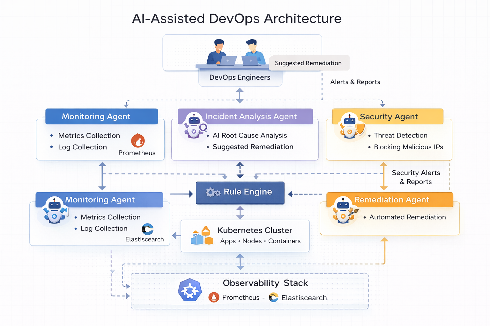

# AI-Assisted DevOps Platform

This project demonstrates how **Artificial Intelligence can assist
DevOps engineers** by automating monitoring, incident detection,
root-cause analysis, and remediation in a Kubernetes environment.

The platform combines:

-   Kubernetes infrastructure
-   Observability stack (Prometheus + Elasticsearch + Kibana)
-   Automated remediation engine
-   AI reasoning agents
-   Security monitoring

The goal is to evolve traditional DevOps automation into **AI-driven
DevOps (AI-Ops)**.

------------------------------------------------------------------------

# Architecture Overview

Infrastructure and applications generate metrics and logs which are
collected by the observability stack. A rule engine detects known
incidents and performs automated remediation. Unknown issues are
analyzed by AI agents.

    Infrastructure + Applications
            |
            v
    Observability Stack
    (Prometheus + ELK)
            |
            v
    Detection Engine
    (Rule Engine)
            |
      +-----+-----+
      |           |
      v           v
    Known Issue   Unknown Issue
    Auto Fix      AI Analysis

------------------------------------------------------------------------

# AI Agents in the System

## Monitoring Agent

Responsibilities:

-   Collect metrics from Prometheus
-   Collect logs from Elasticsearch
-   Monitor Kubernetes cluster state
-   Detect anomalies

Inputs:

-   Node metrics
-   Container metrics
-   Application logs
-   Kubernetes events

Outputs:

-   Incident detection signals

------------------------------------------------------------------------

## Incident Analysis Agent

This agent performs **AI-powered root cause analysis**.

Responsibilities:

-   Analyze logs and metrics
-   Correlate events across systems
-   Identify root cause
-   Suggest remediation

Example:

    Root Cause: Database connection pool exhausted

    Suggested Fix:
    1. Restart API deployment
    2. Investigate database latency

------------------------------------------------------------------------

## Remediation Agent

Performs automated recovery actions.

Safe automated actions:

-   Restart failed pods
-   Restart deployments
-   Scale deployments
-   Cleanup logs
-   Restart DNS services

------------------------------------------------------------------------

## Security Agent

Detects and responds to attacks.

Capabilities:

-   Detect brute force login attempts
-   Detect suspicious API traffic
-   Detect SQL injection patterns
-   Detect abnormal request spikes

Response actions:

-   Block malicious IPs
-   Generate security alerts
-   Notify engineers

------------------------------------------------------------------------

# AI-Ops Workflow

    Cluster Monitoring
            |
            v
    Incident Detection
            |
            v
    Rule Engine
            |
      +-----+------
      |           |
      v           v
    Known Issue   Unknown Issue
    Auto Fix      AI Analysis
            |
            v
    Incident Resolved

------------------------------------------------------------------------

# Project Directory Structure

    AI-Assisted-DevOps-Project
    |
    |-- app
    |   |-- backend
    |   |-- frontend
    |
    |-- infra
    |
    |-- gitops
    |   |-- infra-apps
    |
    |-- ai-ops
    |   |-- agent
    |   |-- collectors
    |   |-- remediation
    |   |-- knowledge
    |   |-- config
    |   |-- llm
    |
    |-- monitoring

------------------------------------------------------------------------

# Technologies Used

Infrastructure - Kubernetes - Docker - Terraform

Observability - Prometheus - Elasticsearch - Kibana

AI / Automation - Python - AI Agents - Rule Engine - LLM Integration
(ChatGPT / Claude)

------------------------------------------------------------------------

# Future Enhancements

Planned improvements:

-   LangChain-based incident reasoning
-   Multi-agent orchestration
-   AI-driven runbook generation
-   AI anomaly detection
-   Automated capacity planning
